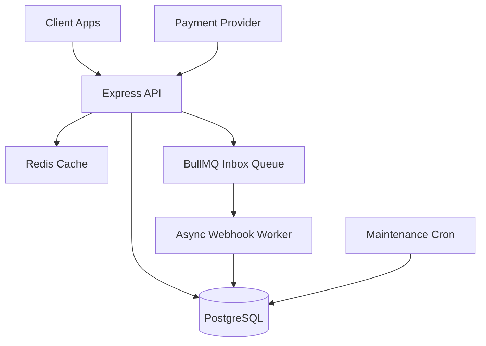

# EVE Healthcare Backend API

A complete backend service for diagnostic test bookings, simulated payments, and idempotent webhook processing. Built with Node.js, TypeScript, Express, Prisma, PostgreSQL, Redis, and BullMQ.

## Architecture

This project is built using a service-oriented architecture with Express controllers delegating to business logic services. It uses PostgreSQL for persistence, Redis for caching (with graceful fallback if offline), and BullMQ for async background jobs.



## Features Implemented
- **Authentication**: JWT-based (signup/login) with role-based access control (USER vs ADMIN).
- **Diagnostic Centres & Tests**: CRUD operations, caching, and distinct pricing per centre (via `CentreTest` join table).
- **Bookings**: State machine (`PENDING` -> `CONFIRMED` | `FAILED` | `CANCELLED`). Enforces time-slot uniqueness via DB partial indexing.
- **Simulated Payments**: Idempotent payment creation. Simulates `SUCCESS`/`FAILED` outcomes probabilistically, overriding possible in test mode.
- **Idempotent Webhooks**: Three-layer idempotency (DB Unique Constraint -> BullMQ Deduplication -> Row-level lock state check).
- **Bonus Features Completed**:
  - Redis caching (with graceful fallback)
  - Background jobs (BullMQ webhook processing + stale booking cleanup)
  - Rate limiting (Redis/Memory)
  - Pagination (all list endpoints)
  - Structured logging (Pino)
  - Swagger/OpenAPI docs
  - Vitest + Supertest integration tests

## Database Schema Highlights
- **`CentreTest` Model**: Represents the many-to-many relationship between Centres and Tests. **Price is stored here**, not on the Test itself, because the same test can have different prices at different locations.
- **Constraints**: 
  - `CHECK` constraints on `price > 0` and `amount > 0` applied via raw SQL.
  - Partial Unique Index on `(centre_test_id, appointment_at) WHERE status IN ('PENDING', 'CONFIRMED')` to strictly prevent double-bookings at the DB level, while allowing cancelled slots to be reused.

## Webhook Idempotency & Concurrency Strategy
1. **Inbox Pattern**: Webhooks are first written to a `WebhookInbox` table with `eventId` as a UNIQUE constraint. Duplicate events throw a `P2002` error and are safely ignored, returning `200 { duplicate: true }`.
2. **Asynchronous Processing**: Valid events are enqueued to BullMQ (using `jobId: eventId` for a second layer of deduplication). The API returns `202 Accepted`. If Redis is down, it falls back to synchronous inline processing.
3. **Pessimistic Locking**: The worker begins a transaction and locks the Payment row (`SELECT ... FOR UPDATE`). This prevents race conditions if two different events for the same payment arrive concurrently.
4. **State Machine Checks**: If a late out-of-order event arrives (e.g., `FAILED` after `SUCCESS`), the state machine rejects the transition because terminal states cannot be changed.

## Setup & Running

### Prerequisites
- Node.js (v18+)
- PostgreSQL (running locally or remotely)
- Redis (Optional, but required for caching and background queues)

### 1. Installation
```bash
npm install
```

### 2. Environment Variables
Copy `.env.example` to `.env` and update `DATABASE_URL` to point to your PostgreSQL instance.
```bash
cp .env.example .env
```
*(If you do not have Redis, set `REDIS_ENABLED=false` in the `.env` file. The app will gracefully fall back to in-memory rate limiting, bypass the cache, and process webhooks synchronously).*

### 3. Database Setup (Migrate & Seed)
Generate the Prisma client, create the database tables, apply raw SQL constraints, and insert fictional demo data.
```bash
npx prisma generate
npx prisma migrate dev --name init
npm run prisma:seed
```

### 4. Run the Application
Start the API server (runs on port 3000):
```bash
npm run dev
```

In a separate terminal, start the background worker (processes webhooks and cleans up stale bookings):
```bash
npm run worker
```

## API Documentation
Once the server is running, visit the interactive Swagger UI:
👉 **[http://localhost:3000/api-docs](http://localhost:3000/api-docs)**

### Key Endpoints & Example Requests

| Method | Endpoint | Description |
|--------|----------|-------------|
| `POST` | `/api/v1/auth/login` | Login to get JWT token |
| `GET`  | `/api/v1/centres` | List centres (cached, paginated) |
| `GET`  | `/api/v1/centres/:id/tests` | List tests at a specific centre |
| `POST` | `/api/v1/bookings` | Book a test slot (JWT required) |
| `POST` | `/api/v1/payments` | Initiate a payment for a booking |
| `POST` | `/api/v1/payments/webhook` | Webhook receiver (Requires `X-Webhook-Secret`) |

#### Example: Login
```bash
curl -X POST http://localhost:3000/api/v1/auth/login \
  -H "Content-Type: application/json" \
  -d '{"email":"user@eve.com", "password":"user1234"}'
```

#### Example: Create Booking
```bash
curl -X POST http://localhost:3000/api/v1/bookings \
  -H "Authorization: Bearer <YOUR_JWT_TOKEN>" \
  -H "Content-Type: application/json" \
  -d '{
    "centreId": "<CENTRE_UUID>",
    "testId": "<TEST_UUID>",
    "appointmentAt": "2026-11-15T10:00:00Z"
  }'
```

## Testing
Run the Vitest test suite (unit and integration tests):
```bash
npm run test
```

## Tradeoffs & Future Improvements
If I had more time, I would improve:
1. **API Gateway / Load Balancing**: Run multiple instances of the API and workers.
2. **Refresh Tokens**: Implement short-lived access tokens with secure HttpOnly refresh cookies.
3. **Audit Logs**: Maintain a separate append-only audit log table for all sensitive actions (admin writes, status changes).
4. **Availability Engine**: Create a robust availability/scheduling engine to manage centre working hours and concurrent slot capacities (currently relies solely on the DB unique constraint).
5. **Real-time Notifications**: Notify the frontend via WebSockets/SSE when a webhook updates a booking status.
